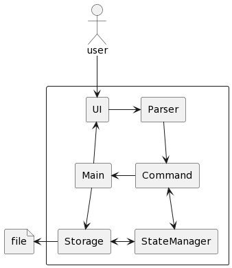
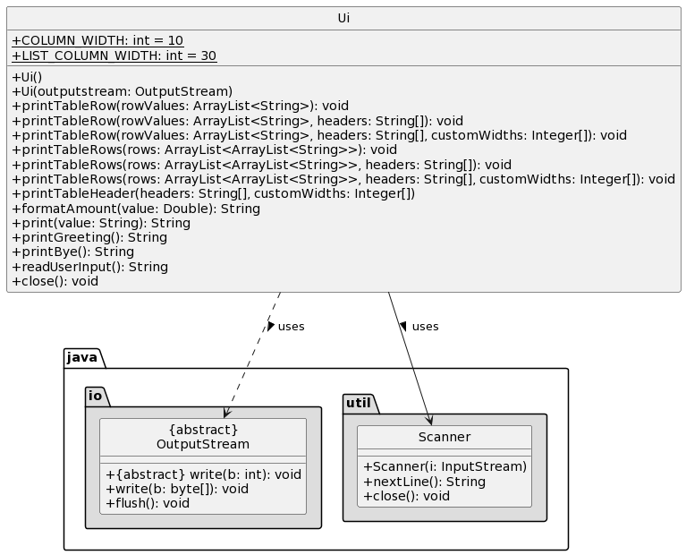
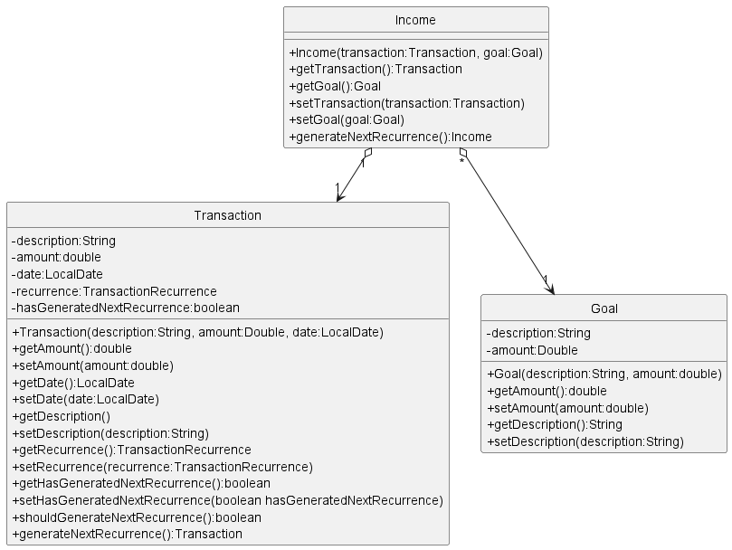

# Developer Guide

## Acknowledgements

1. [OpenCSV](https://mvnrepository.com/artifact/com.opencsv/opencsv)
2. [Apache Common IO](https://mvnrepository.com/artifact/commons-io/commons-io)

## Design

### Architecture

The bulk of the app's work is done by the following four components:
- `UI`: The UI of the App.
- `Parser`: Formats the user's input.
- `Command`: Command's logic and execution.
- `Storage`: Storage of data of the App.
- `StateManager`: Common source of truth for program.

### UI component

The `UI` consists of a `Scanner` and an `OutputStream` object. Together, these objects abstract the functionalities of
obtaining user input and providing feedback (output printed in terminal UI). The `UI` component provides a simple
interface for other components to interact with the user.

The `UI` component:
- provides a method to obtain user input.
- provide methods to print output in tabular format

### Parser component

The `Parser` functionality is to take in a user input, parse it and return the relevant `Command` object based on 
the input.

How the `Parser` works:
1. When the user input any string, it will be passed to a newly constructed `Parser` object.
2. The `parse` function in the `Parser` will be called to extract the command word, description and arguments of the 
command if any.
3. These parsed details will then be passed to the relevant `Command` object based on the command word.
4. Afterward, the `Command` object will be passed back to `Main` for execution.

Note: The `Parser` will not do any validation of arguments or description of the command. Those will be handled by the 
respective `Command` object.

### Command component

The Command component consists of the individual command objects (listed in table below) and an abstract
class `Command`. The `Command` component is responsible for executing the commands after it has been parsed by `Parser`. \
All error handling is handled here and any errors/output would be passed to the `UI` component for printing and
formatting of the output.

| Command Class            | Purpose                                        |
|--------------------------|------------------------------------------------|
| AddExpenseCommand        | Add a new Expense transaction                  |
| AddIncomeCommand         | Add a new Income transaction                   |
| CategoryCommand          | Add/Remove a Category (used for expense)       |
| ExitCommand              | Exit the program                               |
| GoalCommand              | Add/Remove a Goal (used for income)            |
| HelpCommand              | Gives usage format information to the user     |
| ListCommand              | Lists all incoming/outgoing transactions       |
| ExportCommand            | Exports transactions data into CSV FIle        |
| RemoveTransactionCommand | Deletes a transaction                          |
| EditTransactionCommand   | Edits an income/expense transaction            |
| SummaryCommand           | Summarise the total income/expense transaction |

### Storage component
The `Storage` functionality is to load data from the storage files (`category-store.csv` , `expense-store.csv`, `goal-store.csv`, `income-store.csv`) into the application. It will also store any data while the application is running.

The `Storage` component:
- Ensures that all the data that is loaded is able to be parsed properly and stored in the application when booting up
- Skips any rows that have issue during the validation phase
- Saves to storage file after each command completed
- Uses `CsvWriter` and `CsvReader` class to read and write to the storage files.
- `CsvWriter` and `CsvReader` will use `CSVWriter` and `CSVReader` respectively from OpenCSV library to write and read from CSV Files 

### StateManager component
The `StateManager` component provides the program with a single source of truth. `StateManager`'s design follows the singleton design pattern, allowing
only a single instance to be declared throughout the program. Thus, the constructor is explicitly set to private - this is by design.

In order to get the instance of `StateManager` in the program, `StateManager#getStateManager()` should be used.

The `StateManager` component keeps tracking of the income, expenses, goals and categories added to the program. Each entity
is tracked with a corresponding `ArrayList`. `StateManager` also provides the following general utility methods for easy retrieval of data:
- `Storage#addEntity(Entity)` - Add an instance of entity to be tracked
- `Storage#getEntity(int): Entity` - Gets an instance of the entity by index (0-based).
- `Storage#removeEntity>(Entity)` - Removes the provided entity from the corresponding `ArrayList`
- `Storage#removeEntity(int)` - Removes the entity by index (0-based)
- `Storage#getAllEntity(): ArrayList<Entity>`

**Note:** Entity is a placeholder for `Income`, `Expense`, `Goal` and `Category`.

The `StateManager` also contains other methods for managing objects in the state. However, we will not delve into these
more application-specific methods in this section.

## Common Classes
### Income Class
Income class is used to store information of the savings of the user. It is implemented by the aggregation of 
Transaction and Goal classes. Each income is linked to one transaction and goal. The goal is a target set by 
the user for which the money is saved for.

### Expense Class
Expense class is used to store information of the spending of the user. It is implemented by the aggregation of 
Transaction and Category classes. Each expense is linked to one transaction and category. The category is used for 
grouping of related spending such as Food, Transport, School Fees, etc.

## Implementation

### Transaction tracking feature

Transaction tracking is a core functionality in the program. This feature includes two commands `in` and `out` which gives users
the ability to add/remove income or expenses respectively. Also, the user is able to associate an income entry with a goal or have an expense
entry be associated to a category of expenditure.

**Addition Process Flow**

The following functionalities are implemented in `AddIncomeCommand` and `AddExpenseCommand` and its' parent class `AddTransactionCommand`.

An example of the usage of the `in` and `out` command can be found in the [User Guide](https://ay2324s1-cs2113-w12-3.github.io/tp/UserGuide.html).

When a user attempts to add an income or expense entry, the user's input will be validated first to ensure that:
- Description, used to denote information about the transaction entry, is not blank
- Amount is a decimal value that is non-negative.
  - 0 is allowed - Possible use case would be to add a placeholder entry that can be later edited to reflect actual amount.
- Date, if provided, will be verified to ensure validity (`ddMMyyyy` format).
- Recurrence, if provided, is of a valid value (case-insensitive)
  - Valid values are `daily`, `weekly`, `monthly` and `none`.
  - Date, if provided, is additionally verified to ensure that it is not more than or equal to 1 period in the past, relative to current system time.

If any of the above validation fails, an error message relevant to the failure will be printed to inform the user and hint the corrections required.

For attempts to add an income entry, the command will additionally verify that the goal (if specified) already exists in the program. Otherwise,
an error will be returned.

Once a user's inputs are verified and deemed valid, a `Transaction` object is prepared along with a corresponding `Goal` or `Category` object (if required).

These prepared objects are then encapsulated in a corresponding `Income` or `Expense` object and added to the program using `StateManager#addIncome(Income)` or `StateManager#addExpense(Expense)`.

### Export feature

The export feature is facilitated by `CsvWriter` class which uses a third party library called OpenCSV. It implements the following operation:
- `exportTransactionData` - Converts each Transaction into an Array to be stored into the CSV File
- `exportIncomeData` - Exports all income transactions only
- `exportExpenseData` - Export all expense transactions only

Given below is an example usage scenario and how the export features behaves at each step.

Step 1. The user launches the application for the first time. There would be no transactions available to be exported.

Step 2. The user executes `in part-time job /amount 500 /goal car` to create a transaction with the description of `part-time job`, with the `amount` set to `500` and `goal` set to `car` and stores it in the program

Step 3. So when the user executes `export`, it will get all the transactions that the program stored and exports to a CSV file called `Transactions.csv`

However, if the user wishes to export only the income or expense transactions, the user could enter `export /type in` or `export /type out` respectively.

## Product scope

### Target user profile

 Users who prefer a CLI interface over a GUI and want to better manage their finances to gauge their financial health.

### Value proposition

Personal finance tracker to make it easy for users to track and manage their spending, \
and generate daily/weekly/monthly reports to break down how they spend (e.g. spending categories, \
whether they spend above their income, etc).

## User Stories

|Version| As a ... | I want to ... | So that I can ...|
|--------|----------|---------------|------------------|
|v1.0|user|add a new income source|can keep track of my allowances and part-time job earnings|
|v1.0|user|add an expense|can monitor my purchases and stay within my budget|
|v1.0|user|delete a transaction|remove any duplicate or unwanted entries from my expenses|
|v1.0|user|view a list of all my transactions|review my income and expenses|
|v2.0|user|export financial data to a CSV file|use it for client presentations and analysis|
|v2.0|user|set up recurring transactions for mortgage payments and utility bulls|easily track and budget for regular home expenses|
|v2.0|user|set financial goals, such as saving for a down payment on a house|stay motivated and track my progress towards home ownership.|

## Non-Functional Requirements

- The program work on any mainstream OS with Java 11.
- The program should provide a consistent experience across the different platforms as far as possible.
- The program should be able to work locally without internet connectivity.
- The program should be intuitive to use.

## Glossary

| Terms         | Definition                                   |
|---------------|----------------------------------------------|
| Mainstream OS | Windows, Linux, Unix, OS-X                   |

## Instructions for manual testing

Listed below are the steps to test the program manually.

### Launching and exiting the program
1. Launching program
   1. Download the jar file and store it in a new folder.
   2. Run the jar file using `java -jar FinText.jar` (Where FinText.jar is the jar file name)
   3. You will be greeted with a welcome message.
2. Exiting the program
   1. Input `bye` to exit the program safely.

### Adding an income transaction
1. Adding an income transaction.
   1. Test case: `in angbao /amount 100`  
   Expected: An income transaction is being tracked with the description `angbao`, amount `100.00`, date will be the 
   current date, goal `Uncategorised` and recurrence `none`.
2. Adding an income transaction with a specific date.
   1. Test case: `in angbao /amount 100 /date 10112023`  
      Expected: An income transaction is being tracked with the description `angbao`, amount `100.00`, date
      `2023-11-10`, goal `Uncategorised` and recurrence `none`.
3. Adding an income transaction with a specific date and goal.
   1. Prerequisite: A goal `car` must be added first.
   2. Test case: `in angbao /amount 100 /date 10112023 /goal car`  
       Expected: An income transaction is being tracked with the description `angbao`, amount `100.00`, date
       `2023-11-10`, goal `car` and recurrence `none`.
4. Adding an income transaction with a specific date, goal and recurring monthly.
   1. Prerequisite: A goal `car` must be added first.
   2. Test case: `in salary /amount 3000 /date 10112023 /goal car /recurrence monthly`  
      Expected: An income transaction is being tracked with the description `salary`, amount `3000.00`, date
      `2023-11-10`, goal `car` and recurrence `monthly`.

### Adding an expense transaction
1. Adding an expense transaction.
   1. Test case: `out dinner /amount 10`  
      Expected: An expense transaction is being tracked with the description `dinner`, amount `10.00`, date will be the
      current date, category `Uncategorised` and recurrence `none`.
2. Adding an expense transaction with a specific date.
   1. Test case: `out dinner /amount 10 /date 10112023`  
      Expected: An expense transaction is being tracked with the description `dinner`, amount `10.00`, date
      `2023-11-10`, category `Uncategorised` and recurrence `none`.
3. Adding an expense transaction with a specific date and category.
   1. Test case: `out dinner /amount 10 /date 10112023 /category food`  
      Expected: An expense transaction is being tracked with the description `dinner`, amount `10.00`, date
      `2023-11-10`, category `food` and recurrence `none`.
4. Adding an expense transaction with a specific date, category and recurring daily.
   1. Test case: `out dinner /amount 10 /date 10112023 /category food /recurrence daily`  
      Expected: An expense transaction is being tracked with the description `dinner`, amount `10.00`, date
      `2023-11-10`, category `food` and recurrence `daily`.

### Deleting a transaction
1. Deleting an income transaction
   1. Prerequisite: Ensure there is at least 1 income transaction added.
   2. Test Case: `delete 1 /type in`  
      Expected: The first income shown when listing income transactions is deleted.
   3. Test Case: `delete x /type in` (Where `x` is a number greater than the total number of income transactions, or
   less than 1, or is not a number)  
      Expected: A error message will be shown to input valid index.
   4. Test Case: `delete 1`  
   Expected: A error message will be shown to indicate the transaction type.
2. Deleting an expense transaction
   1. Prerequisite: Ensure there is at least 1 expense transaction added.
   2. Test Case: `delete 1 /type out`  
      Expected: The first expense shown when listing expense transactions is deleted.
   3. Test Case: `delete x /type in` (Where `x` is a number greater than the total number of expense transactions, or
      less than 1, or is not a number)  
      Expected: A error message will be shown to input valid index.
   4. Test Case: `delete 1`  
      Expected: A error message will be shown to indicate the transaction type.

### Listing transactions
1. Listing income transactions
   1. Prerequisite: Ensure there is at least 1 income transaction added. A goal `car` is added.
   2. Test Case: `list /type in`  
      Expected: All income transactions will be listed.
   3. Test Case: `list /type in /goal car`  
      Expected: Only income transactions with the goal `car` will be listed.
   4. Test Case: `list /type in /goal car /week`  
      Expected: Only income transactions with the goal `car` and within the current week will be listed.

2. Listing expense transactions
   1. Prerequisite: Ensure there is at least 1 expense transaction added.
   2. Test Case: `list /type out`  
      Expected: All expense transactions will be listed.
   3. Test Case: `list /type out /category food`  
      Expected: Only expense transactions with the category `food` will be listed.
   4. Test Case: `list /type out /category food /week`  
      Expected: Only expense transactions with the category `food` and within the current week will be listed.

### Adding goal
1. Adding goal
   1. Test Case: `goal /add car /amount 1000000`  
   Expected: Goal `car` is added with the amount `1000000`.
   2. Test Case: `goal /add car` (Missing `/amount`)  
   Expected: Error message is shown with the correct usage of the command.

### Removing goal
1. Removing goal
   1. Prerequisite: Ensure that goal `car` is added.
   2. Test Case: `goal /remove car`  
      Expected: Goal `car` is removed. All income transaction with goal `car`, will be changed to goal `Uncategorised`.

### Adding category
1. Adding category
   1. Test Case: `category /food`  
      Expected: Category `food` is added.

### Removing category
1. Removing category
   1. Prerequisite: Ensure that category `food` is added.
   2. Test Case: `category /remove food`  
      Expected: Category `food` is removed. All expense transaction with category `food`, will be changed to category `Uncategorised`.

### Editing a transaction
1. Editing an income transaction
   1. Prerequisite: Ensure that there is at least one income transaction.
   2. Test Case: `edit 1 /type in /description New Edited Description`  
   Expected: The description of the first income transaction shown when listing income transactions will be changed to 
   `New Edited Description`.
   3. Test Case: `edit 1 /type in /amount 1234`  
      Expected: The amount of the first income transaction shown when listing income transactions will be changed to
      `1234.00`.
2. Editing an expense transaction
   1. The output will be similar to editing income transaction, with type `out`.

### Summarise the transaction total
1. Summarise income transactions
   1. Prerequisite: Ensure that there is at least one income transaction.
   2. Test Case: `summary /type in`  
   Expected: Show the total sum of income transactions.
   3. Test Case: `summary /type in /day`  
      Expected: Show the total sum of income transactions that are transacted in the current day.
   4. Test Case: `summary /type in /week`  
      Expected: Show the total sum of income transactions that are transacted in the current week.
   5. Test Case: `summary /type in /month`  
      Expected: Show the total sum of income transactions that are transacted in the current month.
2. Summarise expense transactions
   1. Prerequisite: Ensure that there is at least one expense transaction.
   2. Test Case: `summary /type out`  
      Expected: Show the total sum of expense transactions.
   3. Test Case: `summary /type out /day`  
      Expected: Show the total sum of expense transactions that are transacted in the current day.
   4. Test Case: `summary /type out /week`  
      Expected: Show the total sum of expense transactions that are transacted in the current week.
   5. Test Case: `summary /type out /month`  
      Expected: Show the total sum of expense transactions that are transacted in the current month.

### Exporting transaction
1. Exporting transactions
   1. Test Case: `export`  
   Expected: All transactions will be exported to a file `Transactions.csv`
   2. Test Case: `export /type in`  
      Expected: Only income transactions will be exported to a file `Transactions.csv`
   3. Test Case: `export /type out`  
      Expected: Only expense transactions will be exported to a file `Transactions.csv`

### Help
1. Help
   1. Test Case: `help`  
   Expected: Show all the available commands and description of each command
   2. Test Case: `help x` (Where `x` is the command)  
   Expected: Show the usage and options of the command.